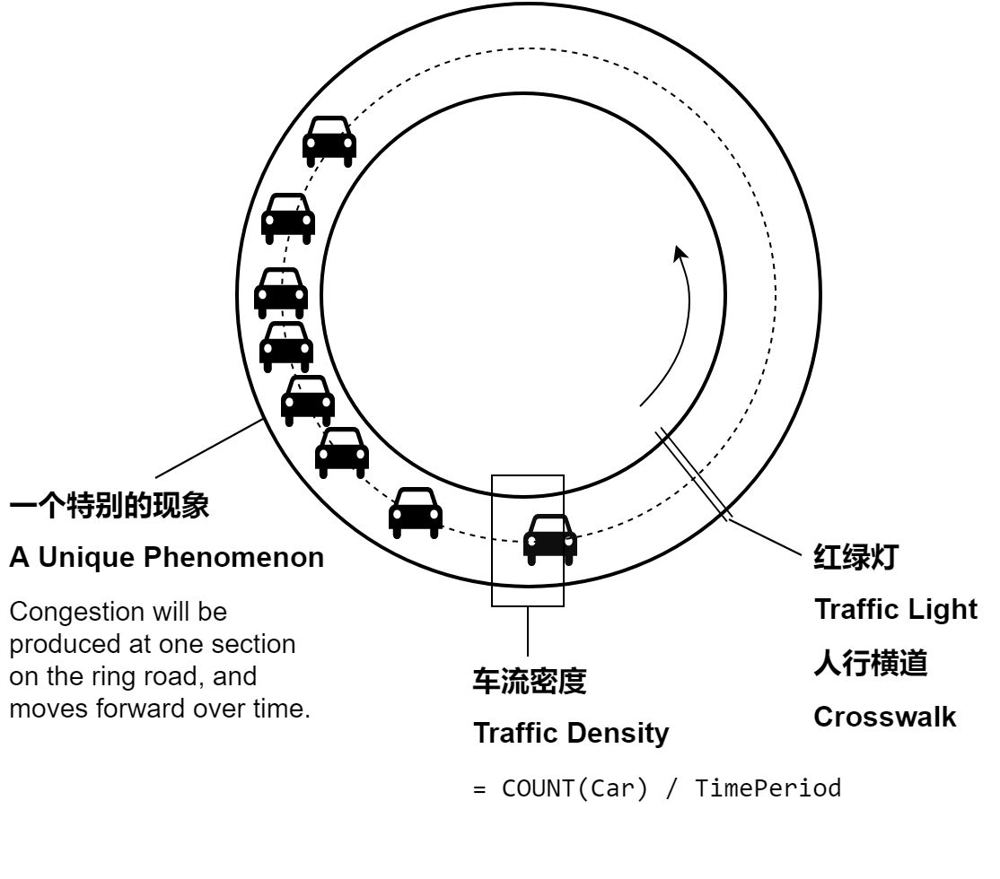
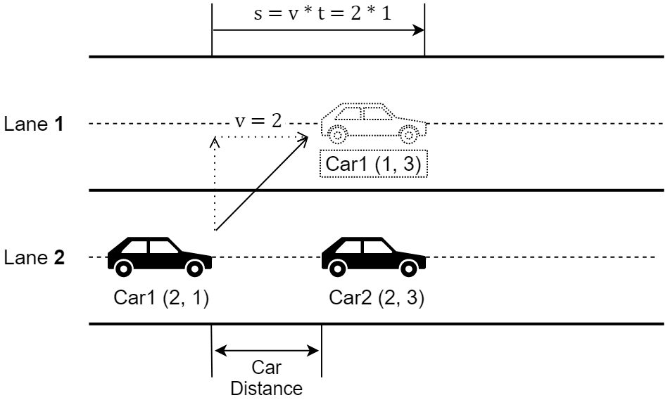

# FYP: Traffic Flow Modeling

> **Changelog**
> v1.0: The first version.
> v1.1: Fix images and add an $s$*-*$t$ diagram.
> v1.2: Fix image of crosswalk and change font family.
> v1.3: Arrange content and improve content on acceleration and deceleration.

**Traffic Flow** is the study of the movement of individual drivers, vehicles between two points, and the interactions they make with one another.

We take **Traffic Flow Modeling** as our FYP's study topic, and we intend to build the corresponding model with Java. We hope the model will help us analyze the traffic and producing our study result.

## The Basic Model

The image above demonstrates our very first idea of traffic flow modeling and on which parts we can develop our model.

This basic model of traffic flow has these following characteristics, which we believe are the common features all car traffics should have:

1. This road contains only one lane, a circular (loop) road. Alternatively, we make a straight road on which cars will return to the beginning when they reach the end of road, which has the same effect of the circular road.
2. Cars on the road travel in one direction.
3. The road has a `maximum speed` requirement for all cars running on it.
4. Each car in the model is created/viewed as an instance of the `Car` class, which has the following properties:
    1. `speed`: the current speed of this car.
    2. `distance`: the distance this car has traveled.
    3. `acceleration`: the acceleration of this car.
    4. `time`: the time this car has run since it started.
    5. `round`: count of times this car has traveled through the whole length of the road.
    6. `name` and `icon`: we give every car a name and icon to distinguish them easily. These fields may be subjected to deletion while we will have more cars in the further development of the model.
5. All cars on the road will keep a `safety distance` with other cars. When one car's distance with its former car is less or equal than the safety distance, the car will need to slow down or stop according to its value of acceleration and distance. After the distance is larger than the safety distance, the car will accelerate to the maximum speed.
**[TODO]** The details will be studied/discussed later in the chapter: [Consideration on the car deceleration](##consideration-on-the-car-decelerate).
6. In runtime, the model will refresh in `periodThread` of time, which is in milliseconds ($1s = 1000ms$). Meanwhile, the model will judge the circumstances for all cars on the road and decide their movements.

Basing on this model, we will consider these future improvements:

1. More car can be added to the road, to a degree that the model can demonstrate some interesting phenomenons as where the congestion usually occurs and why it moves forward as time going.
2. A specific section on the road will be selected, and the `COUNT(Car)`, the number of cars that passed through this section in a specific time period can be counted, and the density of traffic flow at this point can be calculated.
3. Traffic control devices such as traffic light, pedestrian crossing (zebra crossing) can be put on the road to study their influence on traffic. The location of these infrastructures should be able to be modified during the runtime.

## Consideration on the Car Deceleration

Car's deceleration is a relatively complicate a problem in the modeling of traffic flow. In reality, it depends heavily on the driver to decide the time and speed the car need to take for it to avoid collision. Thus, the deceleration value should be various in different situations.
In our preliminary modeling, we will consider the car distance to be that between the head of one car and the tail of its front car. Although in reality, the front car is also travelling forward, and drivers will take that distance the front car travels into their consideration.

Given the de-acceleration $a$, the time $t$, and the speed of car before deceleration $v$, we can conclude that the distance car travels in the deceleration will be $s=vt+\frac12at^2$. By the value of $s$, we can calculate the acceleration value $a$ needed to avoid collision.

## Lane Changing

In future development and improvement of our model, we will need to have multiple car lanes. In this case, to differentiate lanes, we name them as "Lane **1**", "Lane **2**", etc, and cars are able to change lanes. If they may have a relatively slow car in front and a small car distance, and in other lanes, there are longer car distance, then the car will switch the other lane.
For the preliminary concern, we consider the car to be keeping its speed when changing lanes. While in future modeling, we may put it that the cars slow down in this process.

## Traffic Control Devices

The image above demonstrate a scenario of road with a pedestrian crossing (a zebra crossing, to be specific) on it. We may hereby discuss the circumstances of different traffic control devices:

### Traffic Light and Crosswalk (Pedestrian Crossing)

Usually traffic lights are positioned at road intersections, pedestrian crossings to control flows of traffic. Thus, crosswalk and traffic light should have similar circumstances. Before passing traffic lights or crosswalks, driver of the car need to judge whether it's suitable to pass or to stop. In these cases, the distance between the cars should not be the first to consider, as crosswalks and traffic lights are of higher priority.

1. Traffic Lights 🚥
Normally, the traffic lights have three types traffic signals: green, yellow (a.k.a. orange or amber) and red light. Green light means proceed. Yellow light means caution. if the car is before the stop line then it needs to stop, but if it goes beyond the stop line, it can proceed (according to *Law of The People's Republic of China on Road Traffic Safety*). Red light, on the contrary, require all the cars to stop before the stop line.
2. Crosswalk 🚸
Crosswalks are set to keep pedestrians together where they can be seen by motorists, and where they can cross most safely across the flow of vehicular traffic. Cars should slow down at the crosswalk, no matter there're pedestrians or not. If pedestrians are already crossing the crosswalk, all cars should stop and wait until pedestrians crossed.
3. Traffic Warning Signs ⚠️
There are warning signs designed to alert drivers of road conditions or hazards that accidents are frequently occurred. For example, in China, there are warning signs alerting the existence of nearby schools and villages. In these roads, there may not be crosswalks, and drivers should slow down for the safety concerns of villager and school students.
